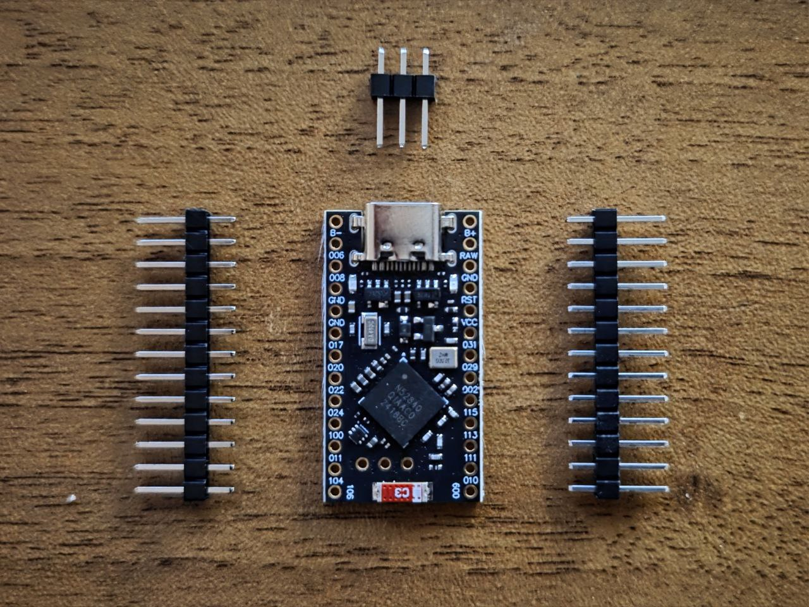
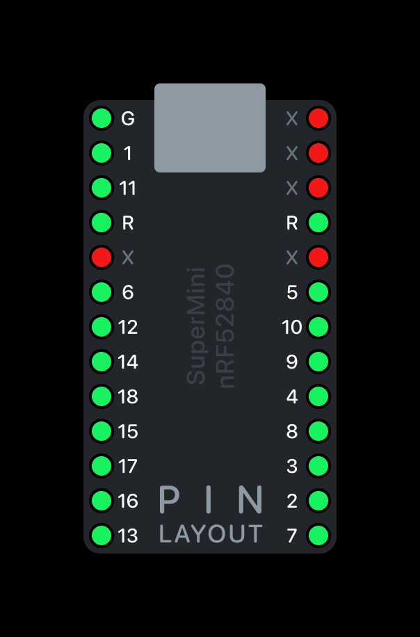
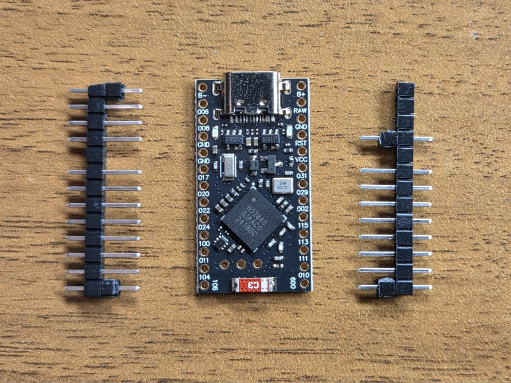
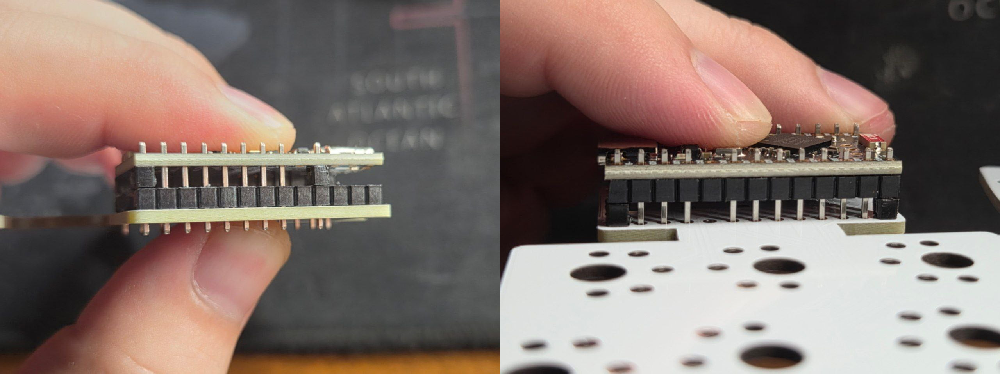
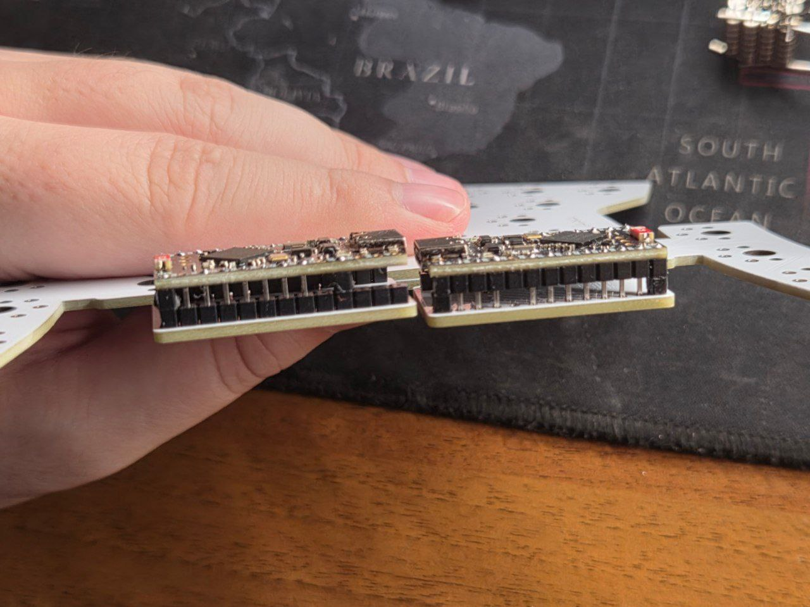

# Инструкция

Для сборки клавиатуры тебе понадобятся следующие детали:

### 1. Непосредственно платы в количестве 2-х штук.

Их можно заказать у любого производителя плат, используя Gerber-файлы из репозитория. Я пользовался услугами [SJ PCB](https://aliexpress.ru/store/129841).

> Почти* актуальный список производителей плат можно посмотреть [здесь](https://t.me/devAlphaSierra/359).

### 2. Контроллеры.

Плата совместима с nRF52840 или nice!nano. Их понадобится 2 или 3 штуки, в зависимости от того, хочешь ли ты использовать Dongle, который продлит жизнь от одного заряда в несколько раз. Купить nRF52840 можно на [AliExpress](https://aliexpress.ru/item/1005008099333183.html).

> Внимание! Иногда контроллеры могут прийти бракованными, поэтому стоит заказать их побольше. Стоят они недорого и уж точно достаточно, чтобы сохранить твои нервы.

### 3. Аккумуляторы.

Понадобится 2 батареи формата `041230`. Я покупал на OZON, но ищется также и на AliExpress.

### 4. Свитчи.

Тебе понадобится 36 свитчей формата Choc v1 или Choc v2. MX или GLP свитчи не подходят! Выбирай на свой вкус и цвет. Я использовал [Kailh Deep Sea Islet](https://aliexpress.ru/item/1005004684367347.html?spm=a2g2w.orderdetail.0.0.1cb14aa6TeBgaj&sku_id=12000040713238946)

### 5. Кейкапы.

Если используются Choc v1 свитчи, то подойдут почти любые кейкапы для Choc свитчей.

Если используются Choc v2 свитчи, то подойдут только кастомные кейкапы, которые имеют Choc-spacing (18×17 против 19×19 у MX) и одновременно MX стем (совместимый с Choc v2 свитчами). Можно, например, использовать [KLP Lame](https://github.com/braindefender/KLP-Lame-Keycaps).

### 6. Детали корпуса

Который состоит из:

1. `Frame` — основная часть typing-кластера.
2. `Thumb` — часть для thumb-кластера.
3. `Cover` — часть, закрывающая контроллер.
4. (Опционально) `Spacer` — маленькая скоба, которая устанавливается между Frame и Cover. Она нужна, если Cover часть напечаталась с маленькой усадкой и он болтается на плате.

> В репозитории имеются как STL файлы, так и 3MF файлы с примерами моих настроек печати.

### 7. (Опционально) 2 кнопки формата [SMD 4x4x1.5mm](https://aliexpress.ru/item/32802382507.html).

Они припаиваются на нижнюю часть плат и служат для быстрого доступа к функции Reset.

Имея все необходимые детали, а также паяльник, припой/пасту и прочие мелочи для пайки, можно приступать к сборке:

### 1. Нужно убедиться в том, что контроллеры работают правильно.

> Это нужно делать **ДО** начала всех других работ!

Для этого нужно прошить их Debug-прошивкой и убедиться в том, что все пины нажимают соответствующие клавиши. Проверить работоспособность матрицы с помощью [key-test.ru](https://key-test.ru), зажимая контакты свитчей пинцетом.

### 2. Подготавливаем гребёнку.

В комплекте с контроллерами есть три гребёнки: две длинных и одна короткая. Нам понадобятся только две длинных.

Ориентируясь на [разметку пинов](./pin_layout_v2.png) нужно удалить из длинных гребёнок металлические штырьки, помеченные на изображении красным цветом. Их припаивать **НЕ** нужно.

Для того, чтобы точно определить высоту гребёнки, можно снять чёрные пластиковые проставки с лишних пинов коротких гребёнок и насадить их по углам длинных гребёнок. Определив нужную высоту, можно откусить лишнее с помощью кусачек.

### 3. Припаиваем гребёнку.

Наносим паяльную пасту на пины гребёнки со стороны платы, выравниваем контроллер, так, чтобы гребёнки были перпендикулярны плате, и по-очереди припаиваем их к плате.

В итоге должно получиться что-то такое:

> Внимание! Оба контроллера должны быть ориентированы вверх. Платы симметричны, поэтому пины гребёнки НЕ нужно переворачивать или отзеркаливать! Они должны быть припаяны в той же ориентации, что и на другой половинке клавиатуры.

### 4. Устанавливаем корпус.

Надеваем на плату Frame и Thumb части корпуса. Вставляем в них свитчи.

> Внимание! Части корпуса должны находиться **между** платой и свитчами.

### 5. Финальная пайка.

Наносим паяльную пасту на контакты свитчей и припаиваем сами свитчи. Просовываем аккумулятор между платой и контроллером, а затем припаиваем его провода к пинам `B+` и `B-` соответственно. В этот момент контроллер замигает красным и/или синим диодами. Примерно в это же время, можно припаять кнопки Reset, если они у вас есть.

### 6. (Опционально) Закрепить проставочную деталь между деталями Frame и Cover

### 7. Прошивка.

Подключаем клавиатуру к ПК, переходим в режим прошивки одним из способов:
- дважды нажав на кнопку Reset
- дважды замкнув горизонтальные пины на обратной стороне платы (где должна быть кнопка Reset).
- дважды замкнув пины `GND` и `RST`, например, с помощью пинцета.

После этого контроллер должен подключиться к ПК как USB-накопитель.
Копируем файл с прошивкой в него и повторяем для другой половинки.

### 8. Финал.

Надеваем крышку контроллера. Приклеиваем силиконовые ножки по периметру, и... Готово!
Повторяем всё то же самое с другой половинкой.
