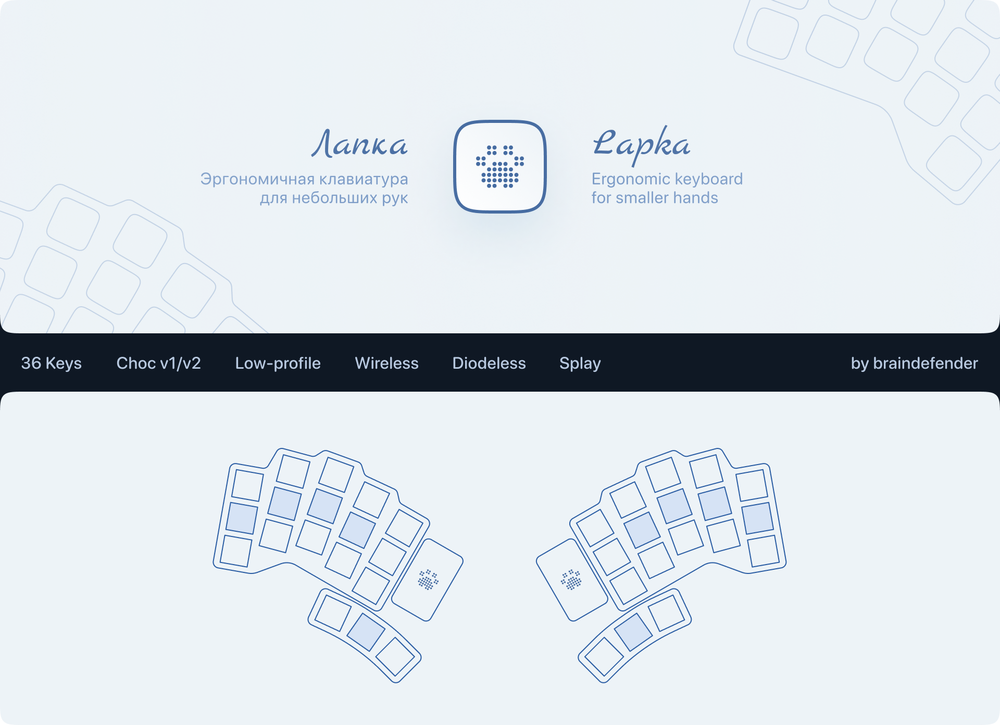
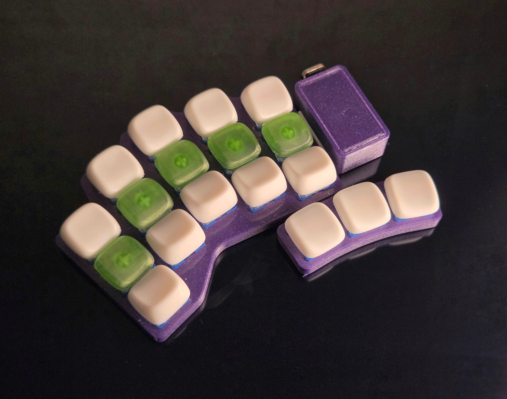
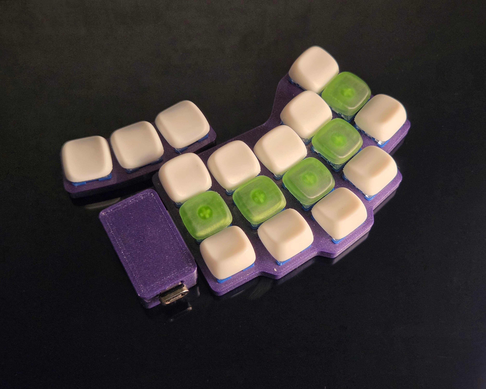

# Лапка

Беспроводная эргономичная сплит-клавиатура для тех, у кого лапки (:

**Особенности:**
- 36 клавиш, совместима с Choc v2 свитчами
- Direct-pin подключение — при сборке не требуются диоды
- Низкопрофильный корпус (свитчи практически касаются стола)

**Структура репозитория:**

| Директория | Описание                                              |
| ---------: | :---------------------------------------------------- |
|        3MF | Проект OrcaSlicer (для примера параметров печати)     |
|     Assets | Изображения и фото                                    |
|     Fusion | Проект Autodesk Fusion 360                            |
|    Gerbers | Gerber-файлы для производства плат                    |
|      Guide | Описание [процесса сборки](./Guide/build-guide-ru.md) |
|      KiCad | Проект KiCad (схема, плата, компоненты)               |
|        STL | 3D-модели частей корпуса                              |

Ссылка на актуальную [прошивку ZMK](https://github.com/braindefender/wellum/tree/master/firmware/zmk/wellum36).
Используйте вариант подключения direct-pin, описанный в `wellum36_left.overlay` и `wellum36_right.overlay`.

Для того, чтобы превратить её в debug-прошивку, надо заменить клавиши на thumb-кластере на какие-нибудь другие.
Например, F1, F2, F3 для левой половинки сплита и F4, F5, F6 для правой.

Это позволит увидеть нажатия клавиш на [key-test.ru](https://key-test.ru).

## История изменений

### v2
- Добавлена поддержка Choc v1
- Изменена разметка пинов
- Обновлена шелкография, логотип перенесён на Cu слой

### v1
- Первый релиз. Только для Choc v2

# Lapka

Wireless ergonomic split keyboard for those who have paws (:

**Peculiarities:**
- 36 keys, Choc v2 compatible
- Direct-pin connection — no diodes needed required
- Low-profile case (switches almost touch the table)

**Repository structure:**

| Directory | Description                                            |
| --------: | :----------------------------------------------------- |
|       3MF | OrcaSlicer project files (printing parameters example) |
|    Assets | Images and photos                                      |
|    Fusion | Autodesk Fusion 360 project                            |
|   Gerbers | Gerber-files for PCB production                        |
|     Guide | [Build guide](./Guide/build-guide-en.md)               |
|     KiCad | KiCad project (schematics, PCB design, components)     |
|       STL | 3D-models of case parts                                |

Link to the current [ZMK firmware](https://github.com/braindefender/wellum/tree/master/firmware/zmk/wellum36).
Use direct pin layout, described in `wellum36_left.overlay` and `wellum36_right.overlay`.

To make debug firmware, you can change thumb-cluster buttons to something else.
For example, F1, F2, F3 for left part of the split, and F4, F5, F6 for the other.

That will help to see keypresses on the [key-test.ru](https://key-test.ru).

## Changelog

### v2
- Added support for Choc v1
- Changed pin layout
- Updated silk-screen, moved logo to Cu layer

### v1
- Initial release. Only for Choc v2

## Фото / Photos

